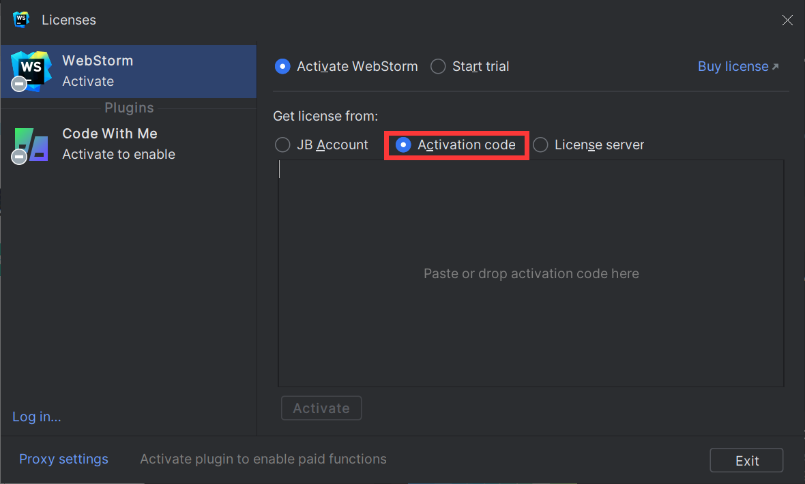

# JetBrains全家桶

由[@LYS](https://lys2021.com/)编辑此页面

****

## 基本介绍

****

JetBrains全家桶是指由JetBrains公司开发的一系列集成开发环境（IDE）和开发工具的组合。它包括多个受欢迎的开发工具：

* CLion：适用于C和C++开发的集成开发环境。
* IntelliJ IDEA：适用于Java、Kotlin、Groovy和其他JVM（Java虚拟机）语言的集成开发环境。 
* PyCharm：适用于Python开发的集成开发环境。 
* WebStorm：适用于JavaScript、HTML和CSS开发的集成开发环境。 
* PhpStorm：适用于PHP开发的集成开发环境。 
* RubyMine：适用于Ruby开发的集成开发环境。  
* DataGrip：适用于数据库开发的集成开发环境。 
* GoLand：适用于Go语言开发的集成开发环境。

这些现代化的IDE不仅极大方便了项目开发，也更适合编程新手快速上手学习。缺点是价格昂贵，一般只有公司企业能够大批量引进进行开发。

如果不进行激活，JetBrains还针对上述工具提供了社区版（Community Edition），足够你学习基础语法，但是并不适合个人进行项目开发。

****

## 安装方式

****

### 官网安装

****

在[JetBrains官网](https://www.jetbrains.com/)进行下载。

<figure markdown>
  { width="600" }
  <figcaption>JetBrains官网首页点击上方Devel poerTools即可</figcaption>
</figure>

在对应IDE介绍主页点击 `Download` 即可跳转到下载界面，然后选择需要下载的版本。

<figure markdown>
  { width="600" }
  <figcaption>上方为专业版，下方为社区版</figcaption>
</figure>

推荐 `Windows` 用户选择 `.exe` 下载安装即可。

****

### Toolbox 安装（推荐）

****

JetBrains为安装了其IDE开发环境的管理工具——Toolbox。

我推荐安装JetBrains Toolbox来安装和管理你的IDE。

首先在[官网安装Toolbox](https://www.jetbrains.com/toolbox-app/)。

<figure markdown>
  { width="600" }
  <figcaption>安装前请确认你的系统版本</figcaption>
</figure>

之后启动Toolbox，它会自动检测你已经安装过的JetBrains IDE。

<figure markdown>
  { width="300" }
  <figcaption>Toolbox主页信息</figcaption>
</figure>

通过Toolbox安装的IDE会显示在已安装里，其他途径安装的会在手动安装一栏，可用栏则会显示所有可安装的JetBrains IDE，你可以选择需要的进行安装或在右上角搜索你需要的IED进行安装。

之后，你便可以通过Toolbox进行快速启动IDE并对其进行更新或卸载。

****

## 激活方式

****

### 学生认证

****

JetBrains系列的产品为学生提供免费服务，申请条件如下：

* 注册一个邮箱信息可用的JetBrains账户
* 拥有学生邮箱，或学信网可查的学籍

由于不可知的原因，河工学生邮箱已停止注册服务（

* 如果你有学生邮箱，可以根据该[教程](https://zhuanlan.zhihu.com/p/136497468)进行申请。

* 如果没有，那么仍可通过学信网及相关文件参考[教程](https://zhuanlan.zhihu.com/p/378185042)进行申请。

ps：该方法申请后有效期为一年，之后需要重新申请，但是可以最大限度的享受到JetBrains全家桶及其相关服务。

****

### 激活码激活

****

以WebStorm为例，在安装完成后首次打开时会出现激活页面。

<figure markdown>
  { width="600" }
  <figcaption>选择Activation code激活</figcaption>
</figure>

这里提供一个[神秘链接](https://pan.baidu.com/s/1m9Fn2Um6kvHKEc-TcSS_gw?pwd=haue)，提供对应激活码即可激活。

**** 

### 服务器激活

以WebStorm为例，在安装完成后首次打开时会出现激活页面。

<figure markdown>
  { width="600" }
  <figcaption>选择License server激活</figcaption>
</figure>

这里提供几个神秘地址：

* [？？？？？？](https://rushb.pro/article/JetBrains-license-server.html)
* [？？？？？？](https://search.censys.io/search?resource=hosts&sort=RELEVANCE&per_page=25&virtual_hosts=EXCLUDE&q=services.http.response.headers.location%3A+account.jetbrains.com%2Ffls-auth)

ps: 需要80或者指定端口状态码为302，且该服务器上有对应IDE的License才能激活，一个不行多试几个，激活失效就重新激活。
